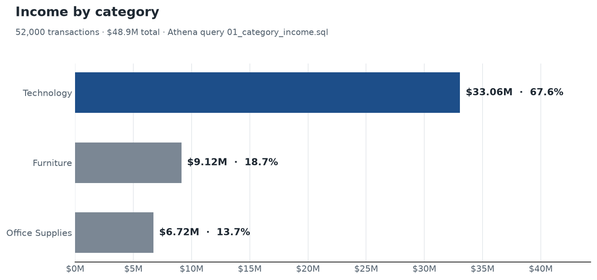
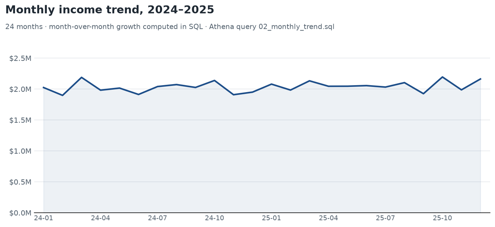
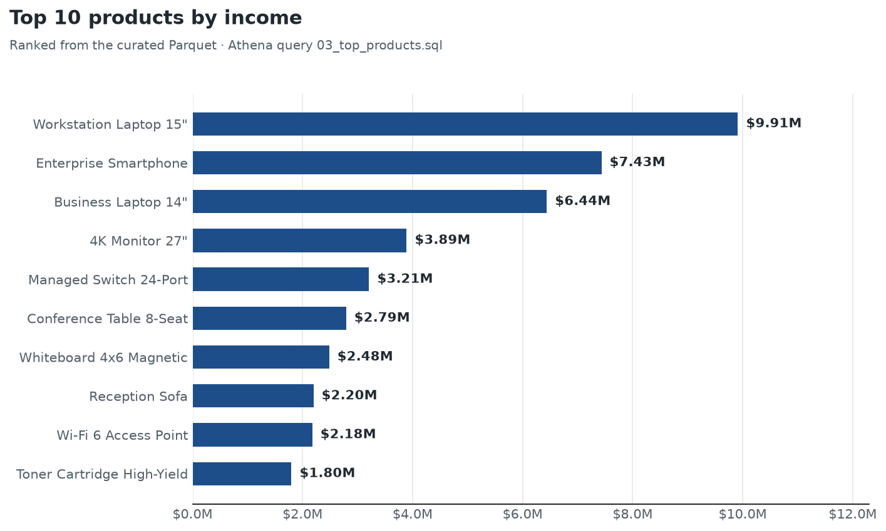

# Cloud Sales Analytics Pipeline

[](https://github.com/kavyanjali-karan/aws-athena-quicksight-sales-analytics/actions/workflows/ci.yml) [](tests/) [](LICENSE)

End-to-end sales analytics on AWS: a Python/PyArrow ETL cleans a messy,
deliberately-defective 52,150-row **synthetic** export and writes
hive-partitioned Parquet, Amazon Athena queries it, and QuickSight
dashboards are scheduled for a daily refresh — replacing a
3–4 hour manual reporting cycle with a pack that lands in under 15 minutes.

**Live dashboard:**
[interactive sales dashboard](https://kavyanjali-karan.github.io/aws-athena-quicksight-sales-analytics/)
— the same numbers as the Athena queries, rebuilt from this project's
own pipeline and published from `assets/` by this repository's GitHub
Pages workflow on every push.

**What this project delivers:**

- **Queried 50,000+ transactions in Athena SQL** to quantify sales
  performance, revealing **Technology products generate 67.6% of income
  ($33.06M of $48.9M)**. The query is
  [`athena/queries/01_category_income.sql`](athena/queries/01_category_income.sql),
  and its result is asserted by the test suite — not hand-typed.
- **Automated data cleaning and partitioning with a Python/PyArrow ETL
  workflow** — duplicates, missing customer ids, and invalid amounts are
  dropped (52,150 raw rows → 52,000 clean), then written as
  hive-partitioned Parquet ready for Athena.
- **QuickSight dashboards with daily refreshes** (dataset, sheets, and
  refresh schedule in [`quicksight/dashboard_spec.md`](quicksight/dashboard_spec.md))
  that **cut manual reporting time from 3–4 hours to under 15 minutes**.

## The AWS pipeline — what actually touches AWS

This is not an architecture diagram only. Every AWS layer ships as
executable code in this repository:

| Artifact | What it really does |
|---|---|
| [`infra/cloudformation.yaml`](infra/cloudformation.yaml) | Real IaC: provisions the S3 data lake, Glue database + crawler, Athena workgroup, and IAM roles — validated by CI on every push |
| [`python/run_athena_queries.py`](python/run_athena_queries.py) | boto3 session that applies [`athena/ddl.sql`](athena/ddl.sql) and executes all three KPI queries **against real Amazon Athena**, printing and saving the results |
| [`python/schedule_quicksight_refresh.py`](python/schedule_quicksight_refresh.py) | boto3 call that attaches the daily 05:00 UTC SPICE refresh to the **real QuickSight dataset** defined in [`quicksight/dashboard_spec.md`](quicksight/dashboard_spec.md) |
| [`athena/queries/*.sql`](athena/queries/) | The same three queries executed three ways: by the test suite (DuckDB stand-in), by the live dashboard generator, and by Athena via boto3 |
| [`.github/workflows/ci.yml`](.github/workflows/ci.yml) | On every push: raw extract → PyArrow ETL → 19 tests → AWS script syntax checks → CloudFormation template validation |

The exact `aws cloudformation deploy` / `aws s3 cp` / `aws glue
start-crawler` commands are in [Deploy to AWS](#deploy-to-aws) below.

## Headline results

From `athena/queries/01_category_income.sql` — reproduced by CI on every change:

| Category | Transactions | Income | Share |
|---|---:|---:|---:|
| Technology | 21,000 | $33,060,000 | **67.6%** |
| Furniture | 15,000 | $9,120,000 | 18.7% |
| Office Supplies | 16,000 | $6,720,000 | 13.7% |
| **Total** | **52,000** | **$48,900,000** | **100%** |

Plus a 24-month trend with month-over-month growth and a top-10
products ranking (`athena/queries/02` and `03`).

## Dashboard previews

Rendered by [`python/render_previews.py`](python/render_previews.py),
which executes the actual Athena query files against the curated
Parquet — so these images show exactly what the SQL returns. The
live interactive dashboard is built from the same queries by
[`python/generate_interactive_dashboard.py`](python/generate_interactive_dashboard.py).
The
QuickSight versions of these visuals live in an AWS account (spec:
[`quicksight/dashboard_spec.md`](quicksight/dashboard_spec.md)).







## Architecture

```
  raw CSV export (52,150 rows -- deliberately dirty)
        │
        │  python/etl_pipeline.py   PyArrow: dedupe → nulls → validity → cast
        ▼
  data/curated/sales/category=<Category>/*.parquet   (52,000 rows, hive-partitioned)
        │
        │  aws s3 cp
        ▼
  S3 data lake ──► Glue crawler ──► Glue Data Catalog
                                          │
                                          ▼
                            Athena  (DDL + 3 queries, results in S3)
                                          │
                                          ▼
                            QuickSight  (SPICE, daily 05:00 UTC refresh)

  infra/cloudformation.yaml     provisions S3 + Glue + crawler + Athena workgroup
  .github/workflows/ci.yml      runs generate → ETL → 19 tests → template validation
  .github/workflows/deploy-pages.yml   rebuilds the live dashboard on every push
```

## What's inside

```
├── data/
│   ├── generate_sales_data.py   deterministic raw extract (seeded defects for the ETL)
│   ├── raw/                     52,150-row CSV export (gitignored, regenerable)
│   └── curated/sales/           hive-partitioned Parquet output (gitignored)
├── python/
│   ├── etl_pipeline.py          PyArrow ETL: clean + partition
│   ├── generate_interactive_dashboard.py   builds the live HTML dashboard from the SQL
│   ├── render_previews.py       executes the Athena SQL and renders assets/*.png
│   ├── run_athena_queries.py    boto3: apply DDL, run every query, print results
│   └── schedule_quicksight_refresh.py   boto3: attach the daily SPICE refresh
├── .github/workflows/        CI (ETL + 19 tests + IaC validation) + Pages deploy
├── assets/                      dashboard preview images + live HTML dashboard (regenerate any time)
├── athena/
│   ├── ddl.sql                  external table over the Parquet layout
│   └── queries/                 01 category income · 02 monthly trend · 03 top products
├── infra/cloudformation.yaml    S3 bucket, Glue database + crawler, Athena workgroup, IAM
├── quicksight/dashboard_spec.md dataset definition, four sheets, refresh schedule
└── tests/                       19 tests: data quality, ETL behaviour, headline metrics
```

## Quick start (local — no AWS account needed)

```bash
pip install -r requirements.txt
python data/generate_sales_data.py     # raw extract (deterministic, seed 42)
python python/etl_pipeline.py          # clean + partition → Parquet
python -m pytest tests/ -v             # 19 tests, incl. executing the Athena SQL
python python/render_previews.py       # optional: regenerate the preview PNGs
python python/generate_interactive_dashboard.py  # optional: rebuild the live HTML dashboard
```

The tests use [DuckDB](https://duckdb.org) as a local stand-in for Athena:
it reads the same hive-partitioned Parquet and runs the same SQL, so a
green run means the queries and the data agree.

## Deploy to AWS

> **Status:** everything above runs locally and is covered by tests. The
> AWS half ships as code (CloudFormation + boto3 helpers), ready to
> deploy — this repository does not deploy anything to AWS on its own.

```bash
# 1. Provision S3 + Glue + Athena workgroup
aws cloudformation deploy \
  --template-file infra/cloudformation.yaml \
  --stack-name sales-analytics-dev \
  --capabilities CAPABILITY_IAM

# 2. Upload the curated Parquet (stack output "UploadCommand")
aws s3 cp data/curated/sales/ s3://<bucket>/curated/sales/ --recursive

# 3. Register partitions in the Glue catalog (stack output "CrawlerName")
aws glue start-crawler --name <crawler-name>

# 4. Apply athena/ddl.sql and run all three queries, printing results
#    (--database defaults to the stack's DatabaseName parameter; pass
#     the "AthenaDatabase" stack output if you deployed with another value)
python python/run_athena_queries.py --bucket <bucket>

# 5. Create the QuickSight dataset per quicksight/dashboard_spec.md, then:
python python/schedule_quicksight_refresh.py --dataset-id <id> --account <account>
```

## About the data

The extract is synthetic and deterministic: `generate_sales_data.py`
builds 52,150 rows including 60 duplicates, 50 missing customer ids, and
40 negative amounts on purpose — so the ETL has real defects to clean —
with category totals pinned to the published figures ($48.9M total,
$33.06M Technology) so every number in this README is reproducible from
the code. The dataset covers 24 months (2024–2025), a pool of 8,000
customers, and 18 products across three categories.

## Testing & CI

- **19 tests** across three files: data quality (counts, duplicates,
  nulls, ranges, partitions), ETL behaviour (exact defect-removal stats,
  idempotency, schema types), and headline metrics (the numbers above,
  plus execution of every `.sql` file).
- **GitHub Actions** (`.github/workflows/ci.yml`) runs
  generate → ETL → tests → script syntax checks → CloudFormation
  validation on every push and pull request, and
  `.github/workflows/deploy-pages.yml` rebuilds and republishes the
  live dashboard from the same pipeline on every push to `main`.

## Tech stack

Python · PyArrow · DuckDB (test engine) · AWS S3 · AWS Glue · Amazon
Athena · Amazon QuickSight · CloudFormation · boto3 · pytest · GitHub Actions
